# CAFFEINE Pod Build Instructions

## Overview

This document will show how to put together a CAFFEINE pod. These are the parts needed:

- ESP32S3
- Breadboard
- 3D Printed Enclosure
- MPU6050 Gyroscope/Accelerometer
- Sound Sensor
- Photoresistor
- HC-SR04 Distance Sensor
- LiPo Rider Plus
- Battery
- Resistor (how many ohms?)
- Jumper wires (15 male-to-male, 6 female-to-male?)

## Build Instructions

### Step 0: Getting the components ready to build

Before wiring anything up, we need to make sure all the components are ready. When buying parts online, they may come with no sockets soldered on or not completely assembled. Make sure the following components all have sockets soldered on:

- MPU6050 (if you want, you can just solder the VCC, GND, SCL, AND SDA pins)
- Sound Sensor
- Distance Sensor

Next, we need to modify the components a little to correctly fit everything in the CAFFEINE pod. Modify the components as shown below:

**MPU6050**

We just need the VCC, GND, SCL, and SDA pins, so if your MPU6050 has more pins soldered on, you'll have to clip them off. This is easy to do using an angle cutter or wire clippers. Your MPU6050 should look like this:

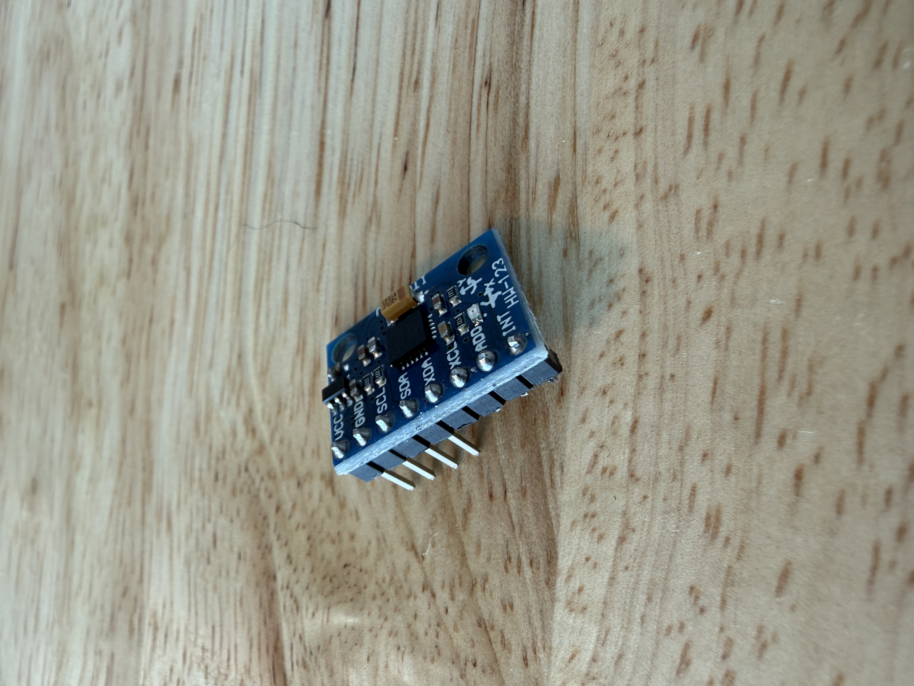

**Sound Sensor**

Make sure the male headers stick out at a 90 degree angle from the circuit board. If they do not, you may have to bend them into shape, which can be done using some pliers. the sound sensor should look like this:

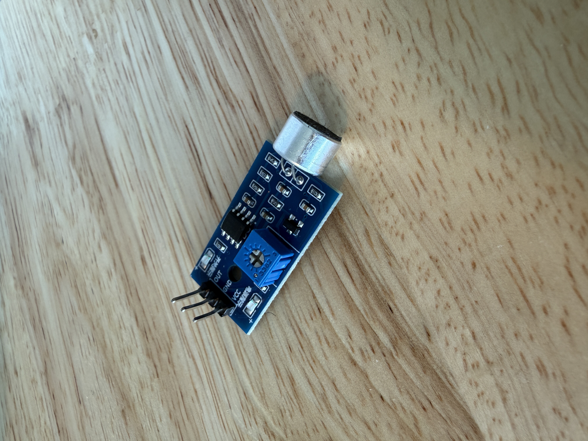

**Distance Sensor**

Like the sound sensor, we need to make sure the male headers on the distance sensor stick out at a 90 degree angle from the circuit board. The distance sensor should look like this:

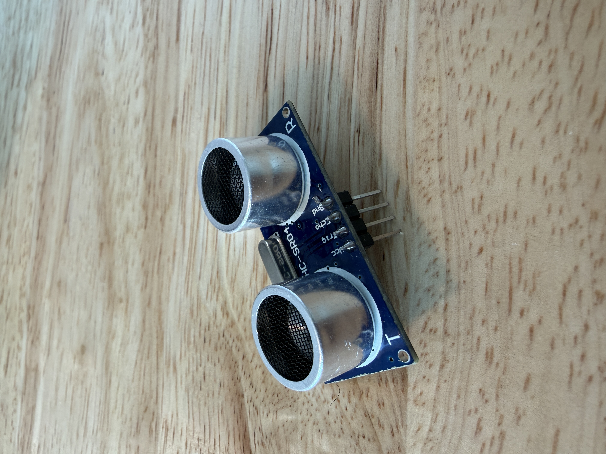

**LiPo Rider Plus**

You will need to solder female headers to the through holes in the LiPo rider plus. When done, it should look like this:
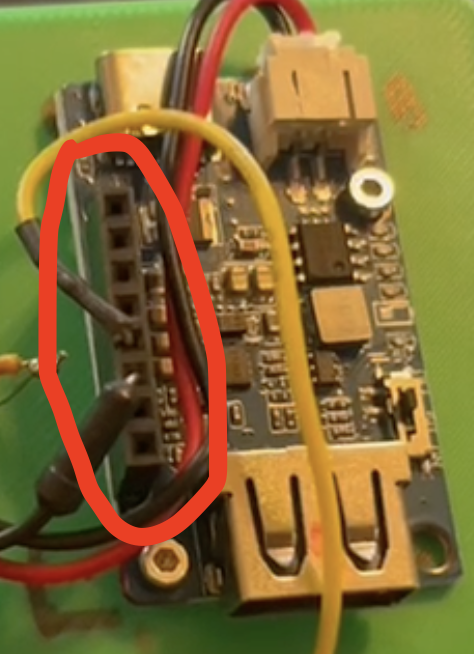

Now, we can start putting things together.

### Step 1: Place the distance sensor in the enclosure

You need to poke the distance sensor through the holes in the enclosure. Make sure to place the sound sensor so that the male headers are closer to the open top of the enclosure. After completing this step, the pod should look like this:

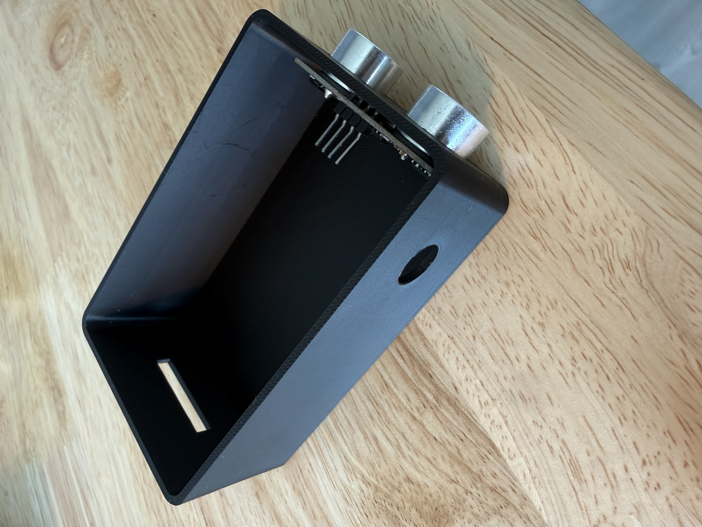

### Step 2: Place the ESP32S3 and the MPU6050 on the breadboard

Place the MPU6050 and the ESP32S3 on the breadboard as shown below:

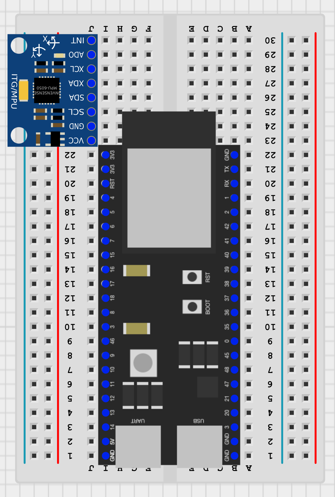

### Step 3: Place the breadboard inside the enclosure

Place the breadboard (which should now have the MPU6050 and the ESP32 connected to it) in the enclosure. You'll need to slide the breadboard under the pins of the distance sensor, as those pins should be sticking out. This is how the pod should look like once this step is complete:

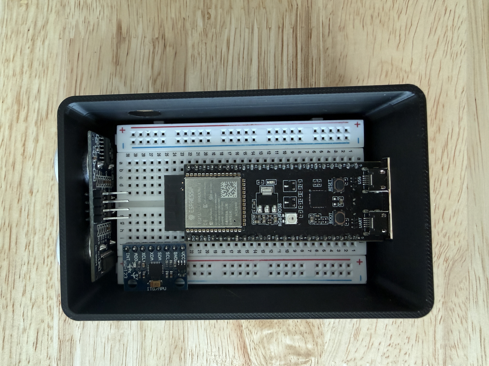

### Step 4: Plug sound sensor into breadboard

Place the sound sensor on the breadboard, leaving some space between the MPU6050 and the sound sensor, as shown in the diagram below:

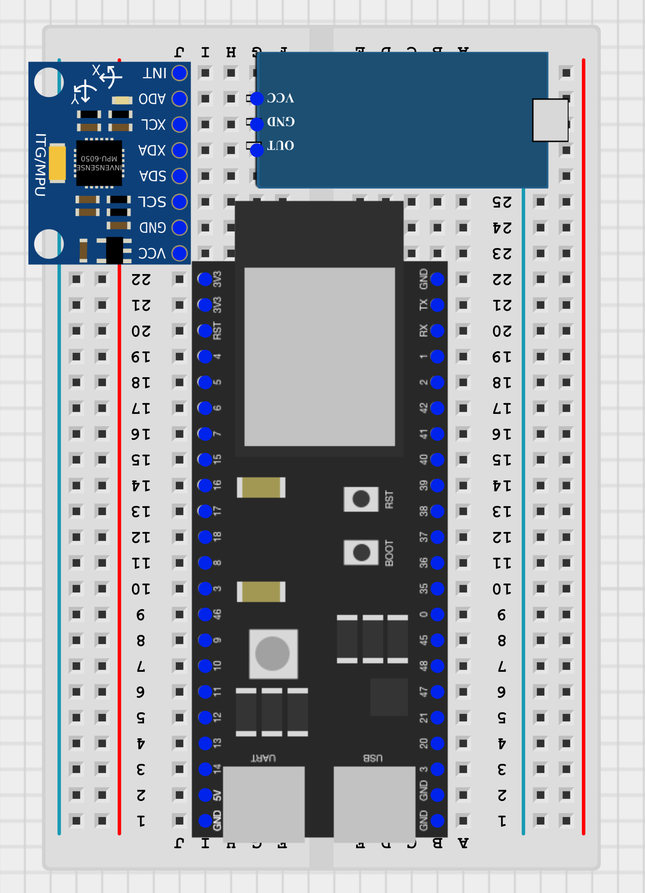

(As you can see, the OUT pin on the sound sensor is on the same row as the XDA pin on the MPU6050, the GND pin is on the same row as the XCL pin, and the VCC pin is on the same row as the ADD pin.)

The round end of the sound sensor should stick into the hole on the side of the enclosure. It can be a little tricky to make it all fit together. It is recommended to hold the round end in place while placing the pins into the breadboard.

Here is how the pod should look after this step is completed:
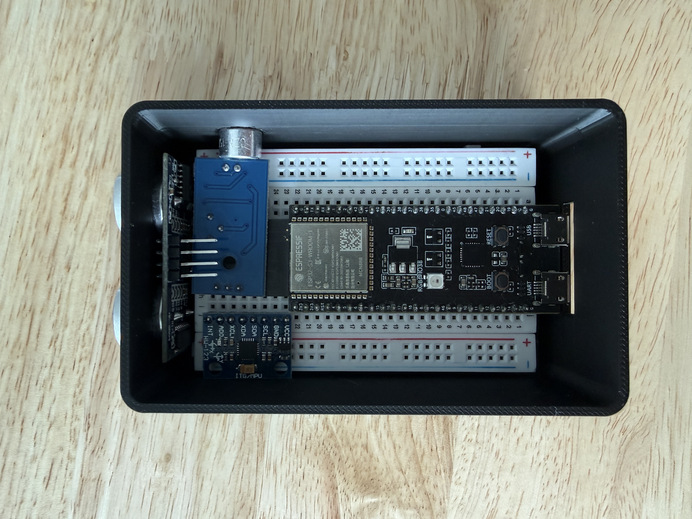

### Step 5: Wire the sensors to the ESP32

**First, make sure the power rails are connected**

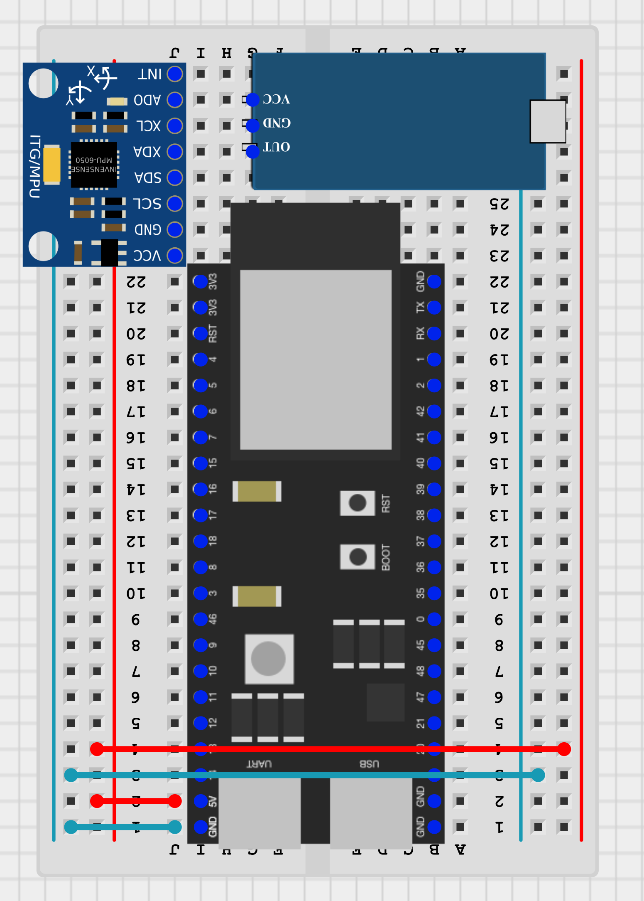

**Second, wire the VCC, GND, SCL, and SDA pins on the MPU6050**

SDA should connect to pin 5 on the ESP32, and SCL should connect to pin 4:

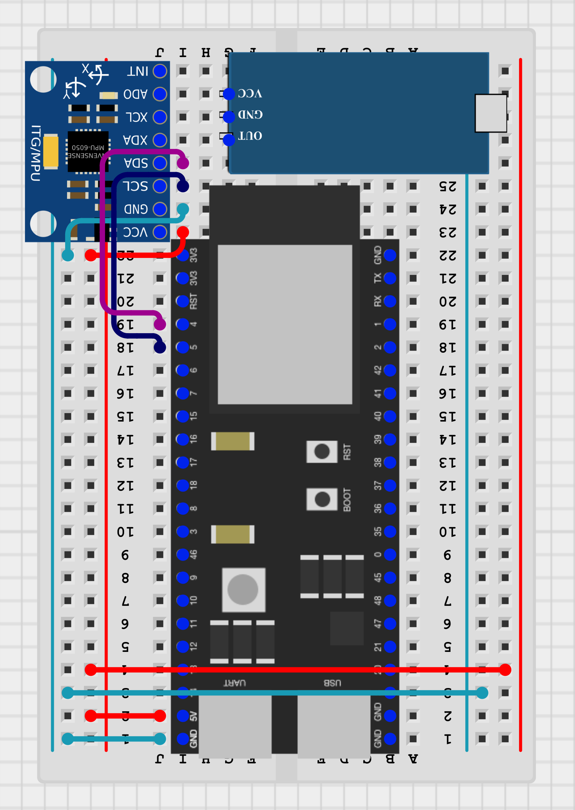

**Next, connect the sound sensor**

Connect the VCC pin on the sound sensor to the power rail, connect the GND pin to the ground rail, and connect the OUT pin to the ESP32:

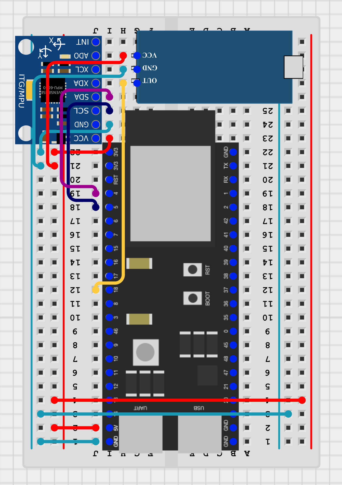

Where to connect the OUT pin should match the `sound_pin` variable in `caffeinepod_osc.ino`. By default, the `sound_pin` variable is set to 18, so (unless you changed the value in `caffeinepod_osc.ino`) connect the OUT pin on the sound sensor to pin 18 on the ESP32

**Next, connect the distance sensor**

Connect the VCC pin to the power rail and the GND pin to the power rail. The echo and trig pins should connect to the pins on the ESP32 indicated by the `echo_pin` and `trig_pin` variables, respectively. By default, `echo_pin` is 6 and `trig_pin` is 7.

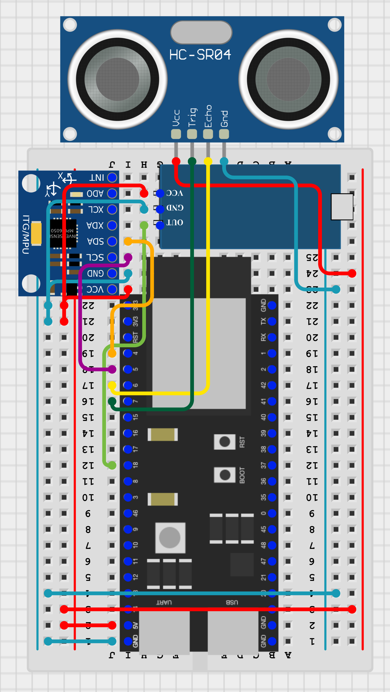

### Step 6: The lid

The battery, LiPo rider, and photoresistor go on the lid of the CAFFEINE pod, and they connect to the rest of the components through jumper cables. It may be easiest to first place the components on the lid and then wire everything together.

You should put the photoresistor through the hole in the lid and use some adhesive (like hot glue or tape) to keep it in place. Likewise, use some adhesive to keep the battery and LiPo rider in place. You can really use anything to keep these components in place, as long as they hold on. For example, the image below uses screws to keep the LiPo rider attached to the lid.

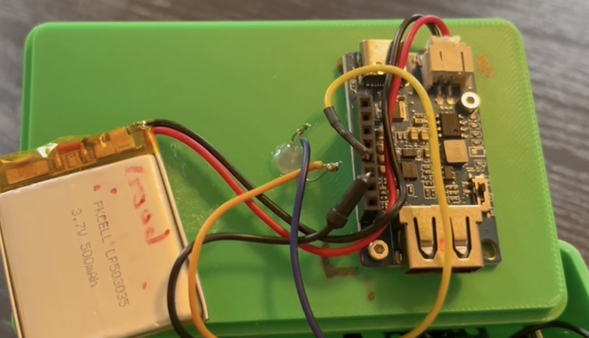

### Step 7: Wiring the lid components

Once the components are on the lid, you can wire them.

First, connect the photoresistor to the breadboard so the ESP32 can read light measurements. Here is an example schematic of the CAFFEINE pod with the photoresistor wired on:

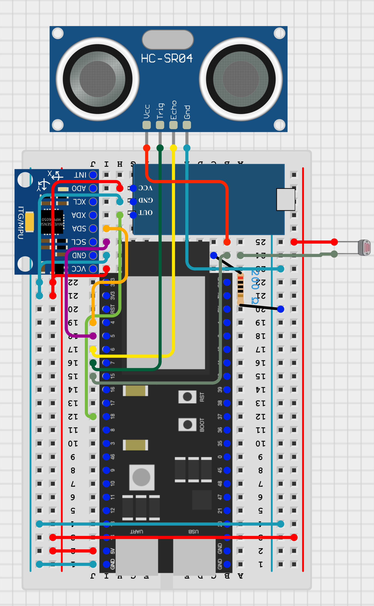

As you can see, one lead of the photoresistor connects to the power rail on the breadboard. The other lead connects to row 24 of the breadboard (or any row with 3 free spaces). Then, a resistor connects from another free space on row 24 to the GND rail on the breadboard. Finally, a jumper wire connects from the final free space on row 24 to the input pin designated by `light_pin` in `caffeinepod_osc.ino` (which is pin 15 by default).

Next, connect the JST connector on the battery to the LiPo rider, as seen in the photo in step 6.

Finally, use jumper wires to connect the GND output of the LiPo rider to the ground (blue) rail on the breadboard. Likewise, connect the 5V output of the LiPo rider to the power (red) rail on the breadboard.

### Step 8: Make noise!

By this point, the CAFFEINE pod hardware is ready to go. From here, fire up the broker and a client file and make some noise!